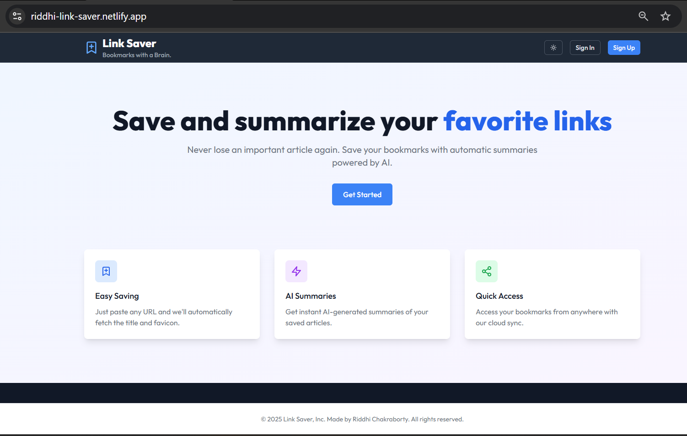
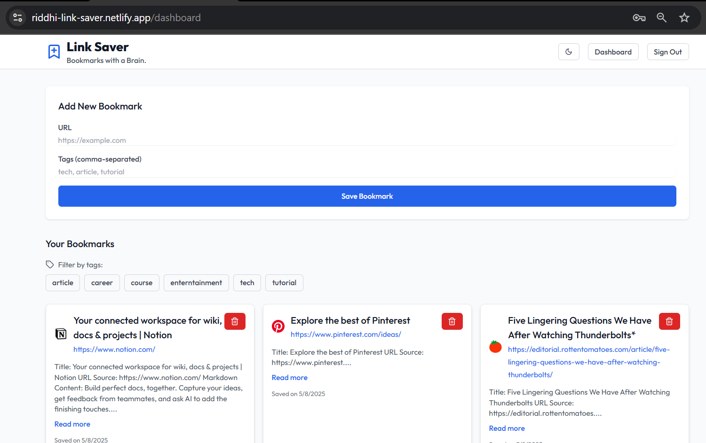
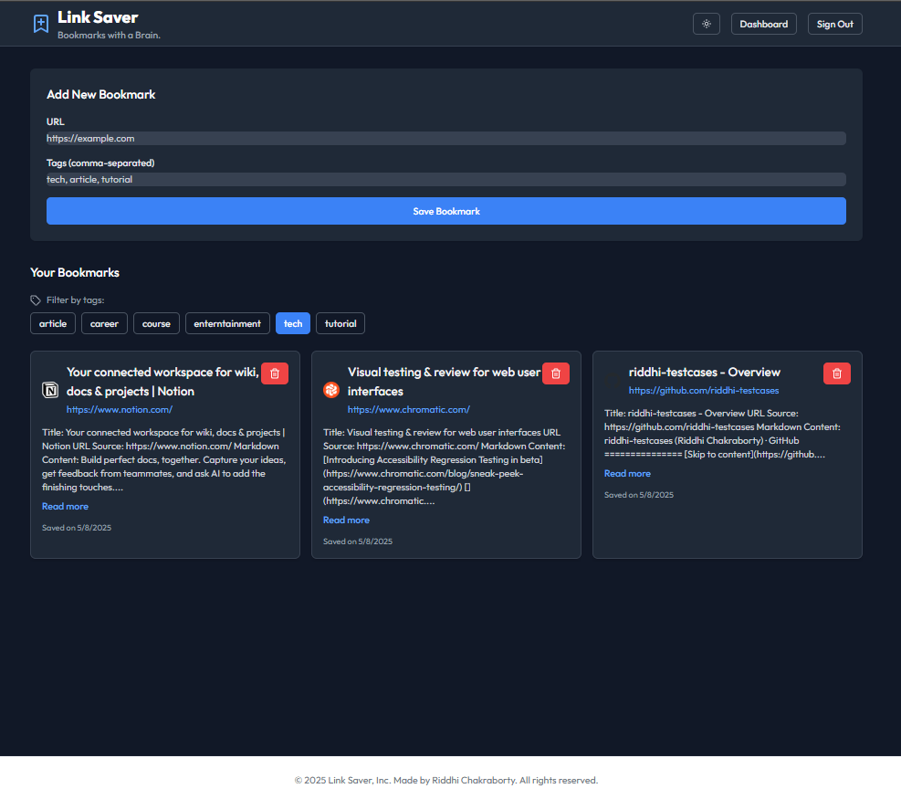

#  Link Saver + AI Summary  
**Bookmarks with a Brain — Save, Summarize, Search.**

A modern full-stack bookmarking tool that lets users save links and view automatic AI-generated summaries using [Jina AI](https://jina.ai/). Built with **React**, **TypeScript**, and **Supabase** for rapid prototyping, responsive UX, and secure authentication.

---

##  Screenshots

 
*Sign in/sign out with Supabase Auth*

  
*Bookmark dashboard with summaries*

  
*Dark mode with filters and summaries*

---

##  Features

###  User Authentication  
- Email/password sign-up & login  
- Passwords hashed using Supabase Auth (uses bcrypt internally)  
- JWT-based session management  
- Fully protected routes and user-specific bookmark storage

###  Smart Bookmarking  
- Paste any URL → auto-extracts title + favicon  
- Summarizes webpage content using **Jina AI’s open API**  
- Bookmarks stored with metadata and summary  
- Delete individual bookmarks  
- Tag-based organization and filtering

###  Modern UI/UX  
- Responsive, accessible, and clean UI  
- Dark mode toggle  
- Smooth transitions and empty/loading/error states  
- Section highlighting in summaries  
- Grid layout with hover interactions

###  Extra Features  
- Tag filtering system  
- URL validation and error handling  
- Expandable summaries  
- React error boundary for reliability

---

##  Tech Stack

###  Frontend
- **React 18** + **TypeScript**
- **Tailwind CSS** for rapid styling
- **Vite** for blazing-fast dev builds
- **React Router** for routing
- **Lucide React** for icons
- **React Hook Form** for validation

###  Backend & Storage
- **Supabase** for Auth & PostgreSQL DB  
- **Row Level Security** for user-specific data  
- **Jina AI** for content summarization

###  Testing
- **Vitest** for unit testing  
- **React Testing Library**  
- **Jest DOM** for DOM assertions  

---

##  Getting Started

### 1. Clone and Install
```bash
git clone https://github.com/yourusername/link-saver.git
cd link-saver
npm install
```

### 2. Environment Setup
```env
VITE_SUPABASE_URL=your_supabase_url
VITE_SUPABASE_ANON_KEY=your_anon_key
```

### 3. Run in Development
```bash
npm run dev
```

### 4. Run Tests
```bash
npm run test
```

### 5. Build for Production
```bash
npm run build
```

---

##  Sample Tests

Example: `BookmarkForm.test.tsx`
```tsx
describe('BookmarkForm', () => {
  it('validates required URL field', async () => {
    render(<BookmarkForm onSubmit={mockOnSubmit} />);
    fireEvent.click(screen.getByRole('button', { name: /Save Bookmark/i }));
    expect(await screen.findByText(/URL is required/i)).toBeInTheDocument();
  });
});
```

Components tested:
- `BookmarkForm`
- `BookmarkItem`
- `Button`
- `TagFilter`

---

##  Future Improvements

### Organizational
- Folder support  
- Nested tags  
- Custom sorting (recent, alphabetical, etc.)

### Feature Additions
- Bookmark sharing  
- Full-text search  
- Reading time estimates  
- Browser extension for 1-click saves

### Performance
- Infinite scroll  
- Virtual list rendering  
- Image & favicon optimization

### UX Polish
- Theme customization  
- Keyboard shortcuts  
- Bulk actions (delete, tag)  
- Import/export bookmarks (JSON, CSV)

---

##  Development Time

| Task                          | Time |
|------------------------------|------|
| Initial setup & auth         | 1 hr |
| Bookmark CRUD + summarization| 2 hrs |
| UI components & styling      | 1.5 hrs |
| Testing                      | 1 hr |
| Docs + polish                | 0.5 hr |
| **Total**                    | **6 hrs** |
