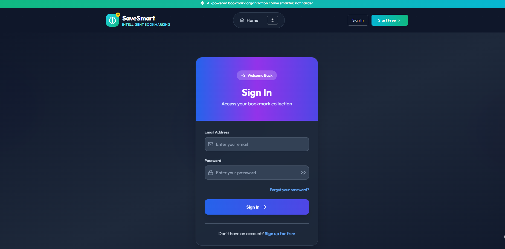
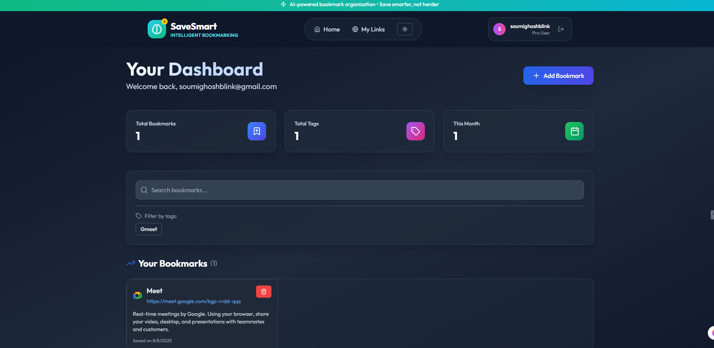
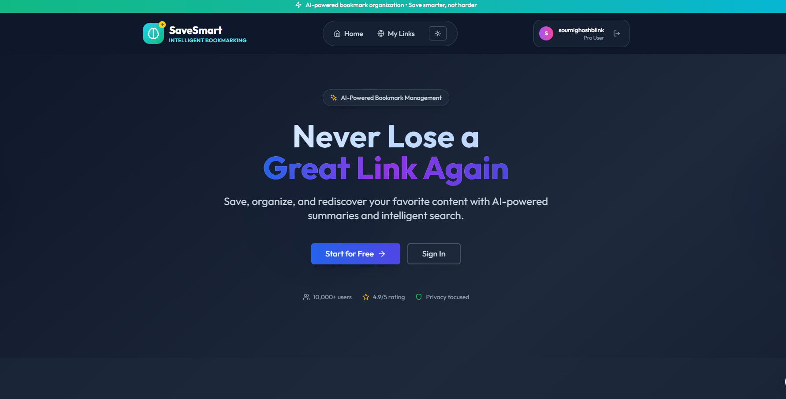

# 🔗 Link Saver + AI Summary  
**Smart Bookmarks with Instant Summaries**

A modern full-stack bookmarking app that lets users save links and instantly generate AI-powered summaries using [Jina AI](https://jina.ai/). Built with **React**, **TypeScript**, and **Supabase** for blazing-fast performance and secure auth.

---

## 📸 Preview

| Sign In | Dashboard | Dark Mode |
|--------|------------|-----------|
|  |  |  |

---

## ✨ Features

### 🔐 Authentication
- Email/password login via **Supabase Auth**
- Secure JWT-based session management
- Route protection & user-specific data storage

### 🧠 Smart Bookmarking
- Auto-fetch title + favicon from URL
- AI summary via **Jina AI API**
- Bookmark CRUD with metadata & tags
- Tag-based filtering & search

### 💡 Modern UX
- Responsive UI with **Tailwind CSS**
- Dark mode toggle
- Smooth transitions & loading states
- Expandable AI summaries
- Grid layout with hover effects

---

## 🧰 Tech Stack

### Frontend  
- **React 18 + TypeScript**  
- **Tailwind CSS**, **Vite**, **React Router**  
- **Lucide Icons**, **React Hook Form**

### Backend & Services  
- **Supabase** (Auth + PostgreSQL + RLS)  
- **Jina AI API** for summarization

### Testing  
- **Vitest**, **React Testing Library**, **Jest DOM**

---

## 🚀 Getting Started

1. **Clone & Install**
   ```bash
   git clone https://github.com/yourusername/link-saver.git
   cd link-saver
   npm install
   ```

2. **Add Env Variables**
   ```env
   VITE_SUPABASE_URL=your_supabase_url
   VITE_SUPABASE_ANON_KEY=your_supabase_anon_key
   ```

3. **Start Dev Server**
   ```bash
   npm run dev
   ```

4. **Run Tests**
   ```bash
   npm run test
   ```

5. **Build**
   ```bash
   npm run build
   ```

---

## ✅ Sample Test

```tsx
describe('BookmarkForm', () => {
  it('validates required URL field', async () => {
    render(<BookmarkForm onSubmit={mockOnSubmit} />);
    fireEvent.click(screen.getByRole('button', { name: /Save Bookmark/i }));
    expect(await screen.findByText(/URL is required/i)).toBeInTheDocument();
  });
});
```

---

## 🛠 Planned Features

- 🔖 Folders, nested tags, custom sorting  
- 🔁 Share bookmarks, import/export (JSON, CSV)  
- 🔎 Full-text search, reading time estimates  
- ⚡ Infinite scroll, virtual rendering  
- 🧩 Browser extension, bulk actions, keyboard shortcuts  

---

## ⏱ Dev Time

| Task                   | Duration |
|------------------------|----------|
| Auth & setup           | 1 hr     |
| Bookmark logic & AI    | 3 hrs    |
| UI & styling           | 1 hr     |
| Testing                | 1 hr     |
| Docs & cleanup         | 0.5 hr   |
| **Total**              | **6.5 hrs** |

---

## 📄 License

[MIT](LICENSE)